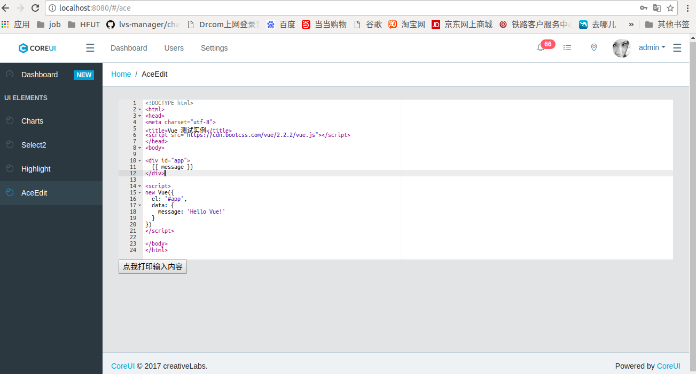

# 说明

本工程是对 `vue2`的学习，第一部分参考了[vue官方文档](https://cn.vuejs.org/),在没有使用vue-cli(官方脚手架) 的情况下练习了官方文档的一些example, 具体见本工程demo目录。第二部分是基于vue-cli/webpack,在参考[CoreUI Vue](https://github.com/mrholek/CoreUI-Vue)的基本模型下连写了vue的使用，以及select2/highlight等组件的使用。

# Start
- git clone https://github.com/asu126/vue-demo.git
- cd vue-demo
- npm install
- npm run dev

### 下面是一些参考文档
- [webpack](https://webpack.js.org/concepts/)
- [饿了么前段，并未使用](http://element.eleme.io)
- [Flex 布局教程](http://www.ruanyifeng.com/blog/2015/07/flex-examples.html)
- [highligtht.js](https://segmentfault.com/a/1190000008188461)
- [ace编辑器部分参考了使用了该brace gem包](https://github.com/thlorenz/brace)，并参考了[vue2-ace-editor](https://github.com/chairuosen/vue2-ace-editor)与vue2的整合方法.
